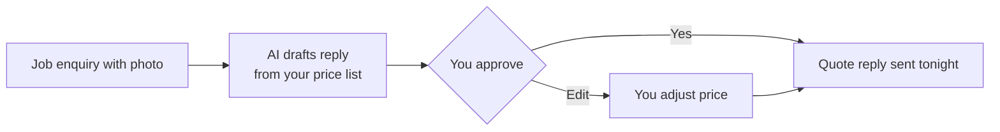

# After-hours quote responder

## What it does

A customer sends a photo of the job at 8pm. The AI reads your price list and past jobs, drafts a quote reply, and sends it after you tap approve on your phone — while you're still on the couch.

## The loop

## How it runs, day to day

1. A customer sends a photo or message after hours — SMS, Messenger or the website form.
2. The AI matches the job to your price list and past jobs, and drafts a reply: rough idea of the work, one clarifying question, and a couple of times you're free.
3. The draft lands on your phone. You approve, edit the price, or stop it — it doesn't send without you.
4. The reply goes out that night, and the enquiry is logged for the follow-up loop.

## What a reply looks like

"Thanks for the photo. I can get you a fixed quote on that — one question first: is the unit easy to reach from the side gate? I'm free Thursday or Friday for a quick look."

## What a human still does

- Approves the price before anything is promised
- Decides anything unusual (hard job, access issues)
- Sets the tone once — a few iterations at the start

## What it runs on

A small always-on computer (a Mac mini is plenty) watching your SMS and Messenger. No website rebuild, no CRM migration needed.

---

*Want this for your business? Free 15-min build review: [yodalai.xyz](https://yodalai.xyz)*
