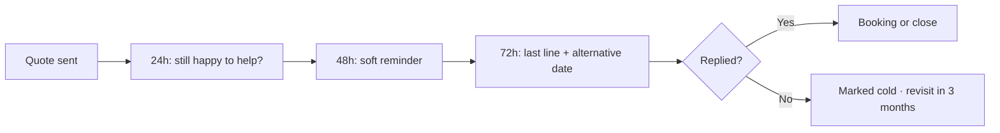

# Quote follow-up chaser

## What it does

Jobs are won on the follow-up, not the first quote. The AI nudges the customer at 24, 48 and 72 hours with the same friendly line you'd use — so no quote ever goes quiet because you forgot.

## The loop

## What a human still does

- Approves the follow-up lines once at the start
- Steps in personally when a big job replies
- Decides when to stop chasing

## What it runs on

Same always-on agent, same inbox. Follow-ups are scheduled, not remembered.

---

*Want this for your business? Free 15-min build review: [yodalai.xyz](https://yodalai.xyz)*
