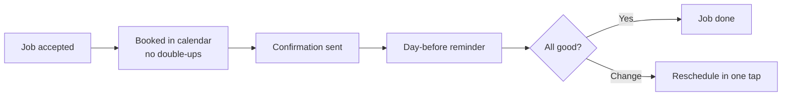

# Job booking + reminders

## What it does

Once the job is accepted, the AI books it into your calendar, sends the customer a confirmation with a window, reminds them the day before, and gives them a one-tap 'I'm running late' path if anything changes.

## The loop

## What a human still does

- Confirms the booking window
- Handles anything the AI flags as unusual
- Approves reschedules that move the job

## What it runs on

Your existing calendar (Google Calendar or Cal.com). The AI never double-books because it checks the calendar before it offers a time.

---

*Want this for your business? Free 15-min build review: [yodalai.xyz](https://yodalai.xyz)*
