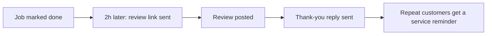

# Review requester

## What it does

Two hours after the job, while the customer is still happy, the AI sends a short message with the Google review link. Reviews arrive while the work is fresh — not a week later when you remember.

## The loop

## How it runs, day to day

1. Two hours after the job is marked done, the review request goes out — while the result is still fresh.
2. One short message, one link. No follow-up nagging.
3. If a review comes in, the AI sends a short thank-you.
4. Customers who leave reviews go on the seasonal reminder list automatically.

## What a reply looks like

"Glad it's all sorted. If you've got a minute, a quick review helps small local businesses a lot — here's the link. Thanks again!"

## What a human still does

- Chooses the review platform (Google, word of mouth)
- Decides whether to ask after tricky jobs

## What it runs on

Same agent. The review request is a message, not an app — it works on SMS and Messenger.

---

*Want this for your business? Free 15-min build review: [yodalai.xyz](https://yodalai.xyz)*
