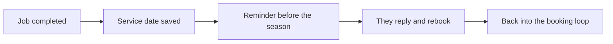

# Seasonal service reminders

## What it does

Past customers come back on schedule: filter checks before winter, hot water service checks, roof inspections before storm season. The AI keeps the list and sends the reminder at the right time — your old customers rebook without you calling them.

## The loop

## What a human still does

- Approves the reminder message
- Sets which jobs are worth a seasonal call

## What it runs on

A simple list the AI maintains from completed jobs. No new software for the customer.

---

*Want this for your business? Free 15-min build review: [yodalai.xyz](https://yodalai.xyz)*
