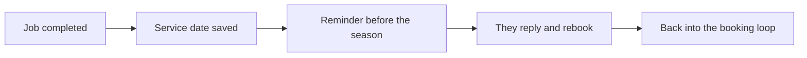

# Seasonal service reminders

## What it does

Past customers come back on schedule: filter checks before winter, hot water service checks, roof inspections before storm season. The AI keeps the list and sends the reminder at the right time — your old customers rebook without you calling them.

## The loop

## How it runs, day to day

1. Every completed job is saved with its natural next-service date.
2. When the season rolls around — winter filters, storm season roofs, hot water checks — the reminder goes out.
3. The reply comes back to you: rebook, ask a question, or pass.
4. Old customers rebook without you ever picking up the phone.

## What a reply looks like

"It's been six months since your last service. Before winter really hits, want me to book the usual check? I've got time next week."

## What a human still does

- Approves the reminder message
- Sets which jobs are worth a seasonal call

## What it runs on

A simple list the AI maintains from completed jobs. No new software for the customer.

---

*Want this for your business? Free 15-min build review: [yodalai.xyz](https://yodalai.xyz)*
