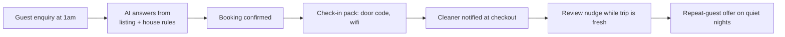

# Short-stay host — the 5 loops

Airbnb-style stays — guest messages answered at 1am, check-in handled, cleaners coordinated, reviews chased.

## The problem

Guests message at 1am asking for the wifi code. You're asleep. The cleaner was double-booked. And the review request never went out — so the five-star review you earned went to a guest who forgot.

## The workflow map

## The 5 daily loops

1. **[Guest enquiry responder](workflows/01-guest-responder)** — 'Is it available for these dates? Can we check in early?' The AI answers from your listing, your calendar and your house rules — and only asks you when a guest wants something unusual.
2. **[Check-in pack sender](workflows/02-checkin-pack)** — The moment a booking is confirmed, the guest gets the check-in pack automatically: address, door code, wifi, house rules, and what to do if anything's wrong.
3. **[Turnover coordinator](workflows/03-turnover-coordinator)** — The AI watches checkout times and tells the cleaner exactly when the room is free.
4. **[Review chaser](workflows/04-review-chaser)** — Right after checkout, while the stay is still fresh, the guest gets a polite nudge with the review link.
5. **[Quiet-night + repeat-guest offer](workflows/05-repeat-guest)** — When a night is sitting empty, past guests who loved the stay get a short note: 'this weekend is free at yours again.

## What a human still does

- Approves every reply before it sends
- Sets the tone once (a few iterations at the start)
- Decides anything unusual — the AI escalates, it doesn't guess

*Generalised from real working patterns. No client details included. Plans shown are plans, not claims of deployed results.*

---

*Book a free 15-min build review: [yodalai.xyz](https://yodalai.xyz)*
