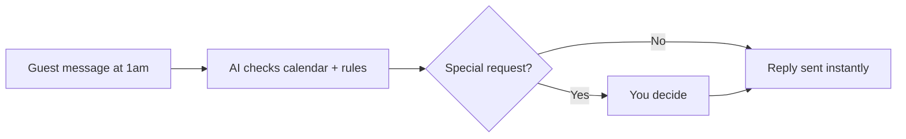

# Guest enquiry responder

## What it does

'Is it available for these dates? Can we check in early?' The AI answers from your listing, your calendar and your house rules — and only asks you when a guest wants something unusual.

## The loop

## What a human still does

- Approves discounts or exceptions
- Decides on pets, parties, long stays

## What it runs on

Watches the platform inbox plus SMS/WhatsApp. Your listing and rules are the only reference it needs.

---

*Want this for your business? Free 15-min build review: [yodalai.xyz](https://yodalai.xyz)*
