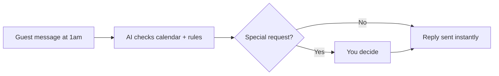

# Guest enquiry responder

## What it does

'Is it available for these dates? Can we check in early?' The AI answers from your listing, your calendar and your house rules — and only asks you when a guest wants something unusual.

## The loop

## How it runs, day to day

1. A guest message lands at 1am — availability, early check-in, pets, 'what's the wifi'.
2. The AI answers from your listing, calendar and house rules — instant, consistent, friendly.
3. Anything unusual — a discount, a party question, a long stay — is flagged to you instead of guessed.
4. Bookable enquiries get a direct booking link in the reply.

## What a reply looks like

"Hi! Yes, those dates are free. Check-in is from 3pm and the door code comes with your booking. Anything you'd like to know about the place?"

## What a human still does

- Approves discounts or exceptions
- Decides on pets, parties, long stays

## What it runs on

Watches the platform inbox plus SMS/WhatsApp. Your listing and rules are the only reference it needs.

---

*Want this for your business? Free 15-min build review: [yodalai.xyz](https://yodalai.xyz)*
