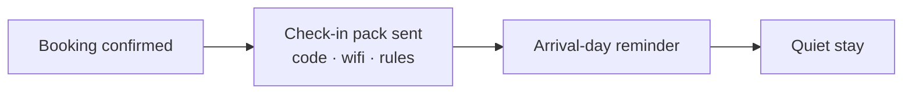

# Check-in pack sender

## What it does

The moment a booking is confirmed, the guest gets the check-in pack automatically: address, door code, wifi, house rules, and what to do if anything's wrong. No more 'where's the wifi?' at midnight.

## The loop

## How it runs, day to day

1. The moment a booking is confirmed, the check-in pack goes out automatically.
2. It contains what guests actually message about at midnight: address, door code, wifi, house rules, what to do if something's wrong.
3. On arrival day, a short reminder confirms everything's ready.
4. You update the pack once when things change — the AI sends the current version every time.

## What a reply looks like

"Welcome! Your stay starts tomorrow. Door code: 4821 · Wifi: the-stay / gold-coast-01. House rules and local recommendations are in the pack. Enjoy!"

## What a human still does

- Updates the pack when the code or wifi changes

## What it runs on

Sends through the platform or WhatsApp. The pack is a saved template the AI personalises per booking.

---

*Want this for your business? Free 15-min build review: [yodalai.xyz](https://yodalai.xyz)*
