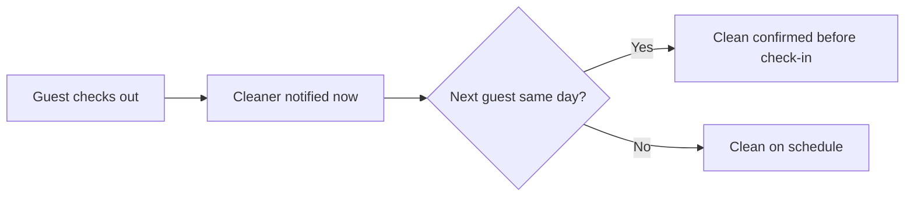

# Turnover coordinator

## What it does

The AI watches checkout times and tells the cleaner exactly when the room is free. If a same-day check-in is coming, it confirms the clean is done before the next guest arrives. No more double-booked cleaners.

## The loop

## What a human still does

- Decides the buffer time between bookings

## What it runs on

Calendar + one message to the cleaner. Nothing new for the cleaner to learn.

---

*Want this for your business? Free 15-min build review: [yodalai.xyz](https://yodalai.xyz)*
