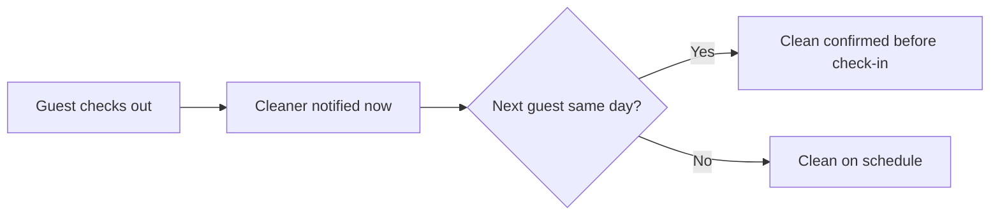

# Turnover coordinator

## What it does

The AI watches checkout times and tells the cleaner exactly when the room is free. If a same-day check-in is coming, it confirms the clean is done before the next guest arrives. No more double-booked cleaners.

## The loop

## How it runs, day to day

1. The AI watches every checkout time in your calendar.
2. The cleaner gets notified the moment a room is free — no back-and-forth about timings.
3. If the next guest checks in the same day, the AI confirms the clean is done before handing over the door code.
4. Buffer times and cleaner preferences are set once; the AI respects them from then on.

## What a reply looks like

"Room ready to clean at 10am — next guest checks in at 3pm, so anytime before 2:30 works. Thanks!"

## What a human still does

- Decides the buffer time between bookings

## What it runs on

Calendar + one message to the cleaner. Nothing new for the cleaner to learn.

---

*Want this for your business? Free 15-min build review: [yodalai.xyz](https://yodalai.xyz)*
