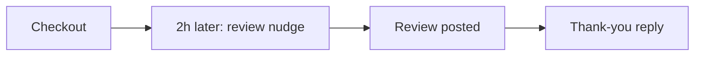

# Review chaser

## What it does

Right after checkout, while the stay is still fresh, the guest gets a polite nudge with the review link. Timed, friendly, and once per stay — never spammy.

## The loop

## What a human still does

- Approves the nudge wording
- Decides whether to follow up on bad feedback personally

## What it runs on

Same agent, same inbox.

---

*Want this for your business? Free 15-min build review: [yodalai.xyz](https://yodalai.xyz)*
