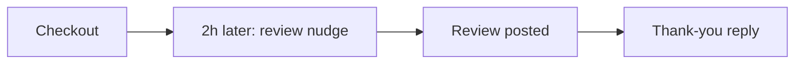

# Review chaser

## What it does

Right after checkout, while the stay is still fresh, the guest gets a polite nudge with the review link. Timed, friendly, and once per stay — never spammy.

## The loop

## How it runs, day to day

1. After checkout, the AI waits a couple of hours — long enough for the goodbye, short enough to be fresh.
2. One polite nudge with the review link. Once per stay, never more.
3. A thank-you goes back automatically when the review lands.
4. Bad feedback is flagged to you privately, not argued with in public.

## What a reply looks like

"Hope you had a lovely stay! If you've got a minute, a review helps us a lot — here's the link. You're welcome back anytime."

## What a human still does

- Approves the nudge wording
- Decides whether to follow up on bad feedback personally

## What it runs on

Same agent, same inbox.

---

*Want this for your business? Free 15-min build review: [yodalai.xyz](https://yodalai.xyz)*
