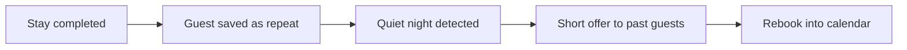

# Quiet-night + repeat-guest offer

## What it does

When a night is sitting empty, past guests who loved the stay get a short note: 'this weekend is free at yours again.' Past guests rebook cheaper than new ones — and the AI keeps the list.

## The loop

## How it runs, day to day

1. Every completed stay is saved to a repeat-guest list.
2. When a night sits empty close to arrival, the AI spots it and drafts a short note to past guests.
3. You approve the offer and the discount level before anything goes out.
4. Past guests rebook in a couple of taps — cheaper to fill, easier to trust.

## What a reply looks like

"This weekend just opened up at yours — first right of refusal goes to guests who've stayed before. Want me to hold it for you?"

## What a human still does

- Approves the offer and the discount level
- Chooses who gets the note

## What it runs on

A guest list the AI builds from completed stays.

---

*Want this for your business? Free 15-min build review: [yodalai.xyz](https://yodalai.xyz)*
