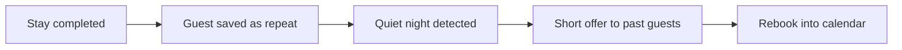

# Quiet-night + repeat-guest offer

## What it does

When a night is sitting empty, past guests who loved the stay get a short note: 'this weekend is free at yours again.' Past guests rebook cheaper than new ones — and the AI keeps the list.

## The loop

## What a human still does

- Approves the offer and the discount level
- Chooses who gets the note

## What it runs on

A guest list the AI builds from completed stays.

---

*Want this for your business? Free 15-min build review: [yodalai.xyz](https://yodalai.xyz)*
