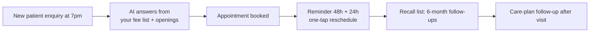

# Allied health clinic — the 5 loops

Physio, dental, chiro — new patient enquiries, appointment reminders, recall lists, after-hours questions.

## The problem

A new patient asks at 7pm how much a session costs — nobody answers, they book the other clinic. A booked appointment no-shows because the reminder never went out. The recall list hasn't been touched in a year.

## The workflow map

## The 5 daily loops

1. **[New patient intake responder](workflows/01-intake-responder)** — The AI answers the questions that decide whether someone books: fees, opening hours, what to bring, how soon they can be seen.
2. **[Appointment reminders (cut no-shows)](workflows/02-reminders)** — Every appointment gets a reminder at 48 hours and 24 hours, with a one-tap reschedule link.
3. **[Recall list runner](workflows/03-recall-list)** — Patients who should come back at 6 or 12 months get a short, friendly nudge at the right time.
4. **[After-hours question responder](workflows/04-afterhours-questions)** — 'Do you bulk bill? What do I bring to my first physio session?' The AI answers from the clinic's own policies at 9pm on a Sunday.
5. **[Care-plan follow-up](workflows/05-careplan-followup)** — After the first visit, the patient gets the exercise sheet or care plan link, and a check-in a few days later: 'how are the exercises going?' If they're due for the next visit, the AI offers the booking.

## What a human still does

- Approves every reply before it sends
- Sets the tone once (a few iterations at the start)
- Decides anything unusual — the AI escalates, it doesn't guess

*Generalised from real working patterns. No client details included. Plans shown are plans, not claims of deployed results.*

---

*Book a free 15-min build review: [yodalai.xyz](https://yodalai.xyz)*
