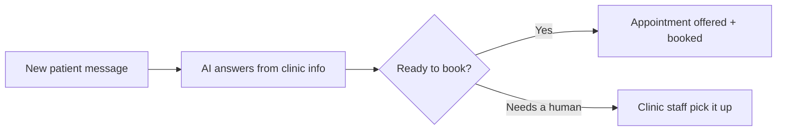

# New patient intake responder

## What it does

The AI answers the questions that decide whether someone books: fees, opening hours, what to bring, how soon they can be seen. It answers from the clinic's own fee list and calendar — and books the appointment directly.

## The loop

## How it runs, day to day

1. New patient messages come in at all hours — website form, SMS, social inbox.
2. The AI answers the questions that decide whether they book: fees, hours, what to bring, how soon.
3. When they're ready, it offers real appointment slots from your calendar.
4. Anything clinical or sensitive is routed to a staff member, not answered by the AI.

## What a reply looks like

"A first appointment is 45 minutes. We're open Monday to Saturday — would Tuesday 10am or Thursday 2:30pm suit better?"

## What a human still does

- Approves anything about treatment or outcomes
- Handles complex cases the AI flags
- Sets the fee list the AI quotes from

## What it runs on

Watches the website form, SMS and social inboxes. Books into the clinic's real calendar.

---

*Want this for your business? Free 15-min build review: [yodalai.xyz](https://yodalai.xyz)*
