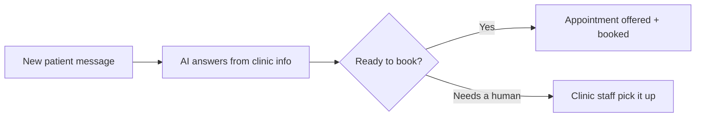

# New patient intake responder

## What it does

The AI answers the questions that decide whether someone books: fees, opening hours, what to bring, how soon they can be seen. It answers from the clinic's own fee list and calendar — and books the appointment directly.

## The loop

## What a human still does

- Approves anything about treatment or outcomes
- Handles complex cases the AI flags
- Sets the fee list the AI quotes from

## What it runs on

Watches the website form, SMS and social inboxes. Books into the clinic's real calendar.

---

*Want this for your business? Free 15-min build review: [yodalai.xyz](https://yodalai.xyz)*
