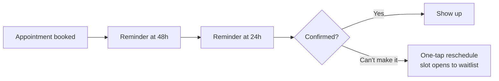

# Appointment reminders (cut no-shows)

## What it does

Every appointment gets a reminder at 48 hours and 24 hours, with a one-tap reschedule link. When someone can't make it, the AI opens the slot to the waitlist automatically.

## The loop

## What a human still does

- Approves the reminder tone and reschedule policy

## What it runs on

The clinic calendar + SMS. No app for the patient to install.

---

*Want this for your business? Free 15-min build review: [yodalai.xyz](https://yodalai.xyz)*
