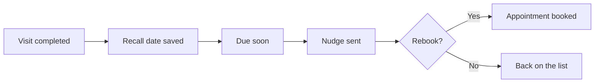

# Recall list runner

## What it does

Patients who should come back at 6 or 12 months get a short, friendly nudge at the right time. The list builds itself from past visits — nobody has to remember who's due.

## The loop

## What a human still does

- Decides which visit types get recall nudges

## What it runs on

A list maintained from the booking calendar.

---

*Want this for your business? Free 15-min build review: [yodalai.xyz](https://yodalai.xyz)*
