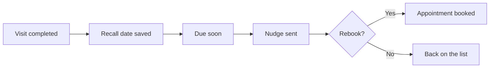

# Recall list runner

## What it does

Patients who should come back at 6 or 12 months get a short, friendly nudge at the right time. The list builds itself from past visits — nobody has to remember who's due.

## The loop

## How it runs, day to day

1. After every visit, the recall date is saved — six months, twelve, whatever the plan says.
2. When patients come due, the nudge goes out: short, friendly, one clear next step.
3. Rebooks land straight in the calendar.
4. The list builds itself. Nobody has to remember who's due.

## What a reply looks like

"It's been six months since your last check-up. Feeling any niggles? We've got time next week if you'd like to come in."

## What a human still does

- Decides which visit types get recall nudges

## What it runs on

A list maintained from the booking calendar.

---

*Want this for your business? Free 15-min build review: [yodalai.xyz](https://yodalai.xyz)*
