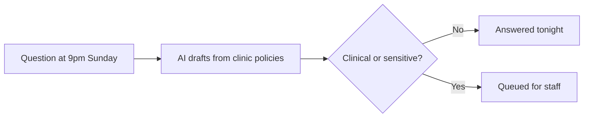

# After-hours question responder

## What it does

'Do you bulk bill? What do I bring to my first physio session?' The AI answers from the clinic's own policies at 9pm on a Sunday. The answer is right, and the patient feels looked after.

## The loop

## How it runs, day to day

1. Questions arrive after hours: fees, bulk billing, what to bring, whether you treat X.
2. The AI answers from the clinic's own policies — the same answers your team would give.
3. Anything clinical, urgent or uncertain is queued for staff with full context.
4. Patients get an answer at 9pm on a Sunday and feel looked after.

## What a reply looks like

"Yes, we're open Saturdays. A first consult is 45 minutes — bring any scans or referral letters you have. Would you like me to find a time?"

## What a human still does

- Approves the clinic policy answers once
- Reviews anything clinical the AI flags

## What it runs on

Same inbox watcher. Policies live in one document the AI quotes from.

---

*Want this for your business? Free 15-min build review: [yodalai.xyz](https://yodalai.xyz)*
