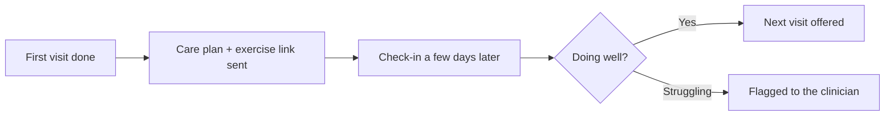

# Care-plan follow-up

## What it does

After the first visit, the patient gets the exercise sheet or care plan link, and a check-in a few days later: 'how are the exercises going?' If they're due for the next visit, the AI offers the booking.

## The loop

## What a human still does

- Writes the care plan the AI delivers
- Handles any flagged struggles personally

## What it runs on

The practice's existing care-plan documents.

---

*Want this for your business? Free 15-min build review: [yodalai.xyz](https://yodalai.xyz)*
