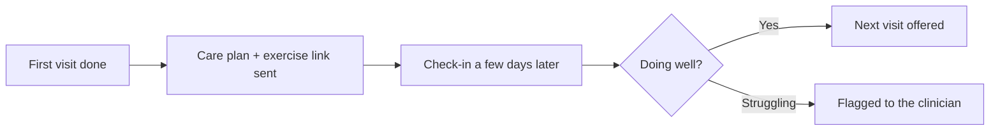

# Care-plan follow-up

## What it does

After the first visit, the patient gets the exercise sheet or care plan link, and a check-in a few days later: 'how are the exercises going?' If they're due for the next visit, the AI offers the booking.

## The loop

## How it runs, day to day

1. After the first visit, the care plan and exercise sheet go out automatically.
2. A few days later, the AI checks in on progress — one question, no nagging.
3. 'Struggling' responses are flagged to the clinician, who decides the next step.
4. When they're due for the next visit, the booking offer goes out with the check-in.

## What a reply looks like

"How are the exercises going? If anything's sore in a new way, let us know — happy to adjust. You're due for a follow-up soon; want me to book it?"

## What a human still does

- Writes the care plan the AI delivers
- Handles any flagged struggles personally

## What it runs on

The practice's existing care-plan documents.

---

*Want this for your business? Free 15-min build review: [yodalai.xyz](https://yodalai.xyz)*
