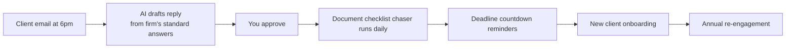

# Accountant & bookkeeper — the 5 loops

Documents chased, deadlines reminded, clients onboarded, queries answered — at tax time and every other time.

## The problem

The BAS is due Friday and three clients haven't sent their numbers. Chasing documents eats the week. And the client who emailed 'just a quick question' at 6pm is now your competitor's client.

## The workflow map

## The 5 daily loops

1. **[Document request chaser](workflows/01-doc-chaser)** — Every client has a checklist of what you need — bank statements, invoices, receipts.
2. **[Deadline countdown reminders](workflows/02-deadline-reminders)** — Before every BAS, tax or lodgement deadline, clients get a countdown: 'BAS due in 5 days — we still need your fuel logs.
3. **[New client onboarding](workflows/03-onboarding)** — When a new client signs, the AI sends the welcome pack, the engagement checklist, and chases signatures and documents in order.
4. **[Query triage responder](workflows/04-query-triage)** — 'Do I need to pay GST on this?' 'Can you send my income summary?' The AI drafts replies from the firm's own standard answers and history — you approve, it sends.
5. **[Annual re-engagement](workflows/05-reengagement)** — Clients you haven't heard from since last year get a nudge at the right moment — before EOFY, before a known change (new home, new business).

## What a human still does

- Approves every reply before it sends
- Sets the tone once (a few iterations at the start)
- Decides anything unusual — the AI escalates, it doesn't guess

*Generalised from real working patterns. No client details included. Plans shown are plans, not claims of deployed results.*

---

*Book a free 15-min build review: [yodalai.xyz](https://yodalai.xyz)*
