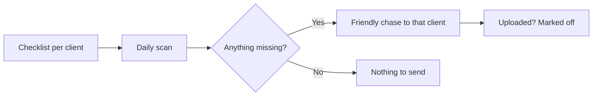

# Document request chaser

## What it does

Every client has a checklist of what you need — bank statements, invoices, receipts. The AI scans the list every morning and chases exactly what's missing, one friendly message at a time. No more 'just following up' emails.

## The loop

## What a human still does

- Approves chase wording per client segment
- Handles clients the AI flags as stuck

## What it runs on

Watches your inbox + a simple checklist. Works with the tools you already use.

---

*Want this for your business? Free 15-min build review: [yodalai.xyz](https://yodalai.xyz)*
