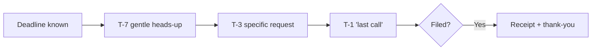

# Deadline countdown reminders

## What it does

Before every BAS, tax or lodgement deadline, clients get a countdown: 'BAS due in 5 days — we still need your fuel logs.' Deadlines stop being a surprise.

## The loop

## What a human still does

- Approves the reminder schedule
- Extends deadlines for real-life situations

## What it runs on

The firm's deadline calendar. Messages go out by email or SMS.

---

*Want this for your business? Free 15-min build review: [yodalai.xyz](https://yodalai.xyz)*
