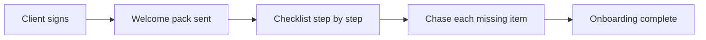

# New client onboarding

## What it does

When a new client signs, the AI sends the welcome pack, the engagement checklist, and chases signatures and documents in order. Day one looks organised — and it stays that way.

## The loop

## How it runs, day to day

1. New client signs → welcome pack goes out immediately.
2. The engagement checklist is sent one step at a time, not as a wall of forms.
3. Each missing signature or document gets a specific, friendly chase.
4. When step one is done, step two arrives. Day one looks organised.

## What a reply looks like

"Welcome aboard! Step 1 of 4: sign the engagement letter here. The next step arrives the moment that's done."

## What a human still does

- Approves the onboarding pack once
- Steps in for high-value clients

## What it runs on

Same inbox watcher, one onboarding template per service line.

---

*Want this for your business? Free 15-min build review: [yodalai.xyz](https://yodalai.xyz)*
