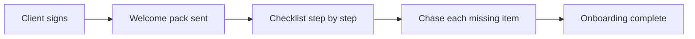

# New client onboarding

## What it does

When a new client signs, the AI sends the welcome pack, the engagement checklist, and chases signatures and documents in order. Day one looks organised — and it stays that way.

## The loop

## What a human still does

- Approves the onboarding pack once
- Steps in for high-value clients

## What it runs on

Same inbox watcher, one onboarding template per service line.

---

*Want this for your business? Free 15-min build review: [yodalai.xyz](https://yodalai.xyz)*
