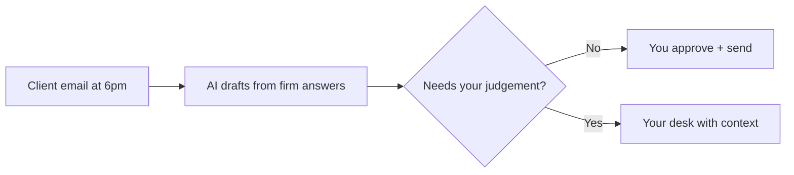

# Query triage responder

## What it does

'Do I need to pay GST on this?' 'Can you send my income summary?' The AI drafts replies from the firm's own standard answers and history — you approve, it sends. Clients get answers fast, you keep the judgement.

## The loop

## What a human still does

- Approves every reply before it sends
- Owns anything that is actual tax advice

## What it runs on

Reads the firm's previous answers to keep tone and accuracy consistent.

---

*Want this for your business? Free 15-min build review: [yodalai.xyz](https://yodalai.xyz)*
