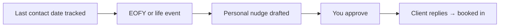

# Annual re-engagement

## What it does

Clients you haven't heard from since last year get a nudge at the right moment — before EOFY, before a known change (new home, new business). Past clients come back before they drift to another firm.

## The loop

## What a human still does

- Approves who gets nudged and when
- Personalises anything sensitive

## What it runs on

A simple client list with last-contact dates.

---

*Want this for your business? Free 15-min build review: [yodalai.xyz](https://yodalai.xyz)*
