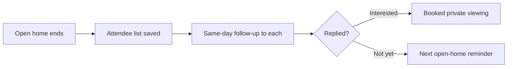

# Open-home follow-up (same day)

## What it does

Everyone who walks through gets a follow-up within hours, not days: a short, personal line about the property plus the next open-home time. Speed is the whole game — the AI never sleeps after an inspection.

## The loop

## How it runs, day to day

1. The open home ends; the attendee list is captured.
2. Within hours, each attendee gets a short follow-up — a line about the property and the next open time.
3. Interested replies are sorted for private viewings; the rest get a gentle reminder.
4. Speed is the whole game — the follow-up lands while they're still talking about the place.

## What a reply looks like

"Thanks for coming through on Saturday — great to meet you. This one's getting strong interest; next open is Wednesday 5pm. Want a private look before then?"

## What a human still does

- Approves the follow-up lines once
- Takes over the hot leads personally

## What it runs on

Reads the sign-in sheet / enquiry list. Messages go out by SMS or email.

---

*Want this for your business? Free 15-min build review: [yodalai.xyz](https://yodalai.xyz)*
