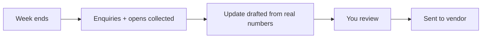

# Vendor update loop

## What it does

Sellers want to know what's happening. The AI sends a weekly update: enquiries this week, open-home numbers, feedback themes — from real data, not guesses. Vendors stay calm because they're never in the dark.

## The loop

## How it runs, day to day

1. Every week, the AI collects what actually happened: enquiries, opens, viewings, feedback themes.
2. It drafts an update for the vendor from real numbers — no guesses, no spin.
3. You review and add anything off-record before it sends.
4. Vendors stay calm because they're never in the dark.

## What a reply looks like

"Here's your weekly update: enquiries this week, two opens, one private viewing booked. Buyers keep mentioning the yard — the plan for next week is to lean into that."

## What a human still does

- Approves the update before it goes out
- Adds anything off-record

## What it runs on

Compiles from the same inbox and calendar the agency already uses.

---

*Want this for your business? Free 15-min build review: [yodalai.xyz](https://yodalai.xyz)*
