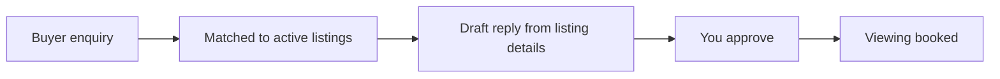

# Buyer enquiry matcher

## What it does

A buyer asks about a suburb or price range. The AI matches them to active listings and drafts a reply from the listing's own details. Enquiries become viewings instead of dead ends.

## The loop

## How it runs, day to day

1. A buyer enquiry comes in — suburb, price range, must-haves.
2. The AI matches them against active listings and drafts a reply from the listing's own details.
3. You approve anything price-related; the AI handles the rest.
4. Enquiries become viewings instead of dead ends.

## What a reply looks like

"Based on what you're looking for, this one fits: three-bed, leafy street, minutes from the park. Open Saturday 11am — want me to send the listing through?"

## What a human still does

- Approves price-related replies
- Handles anything the AI flags as sensitive

## What it runs on

Reads the agency's active listings + enquiry inbox.

---

*Want this for your business? Free 15-min build review: [yodalai.xyz](https://yodalai.xyz)*
