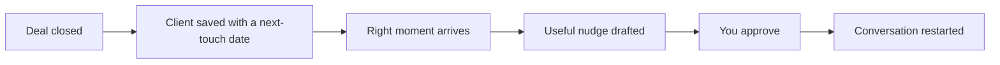

# Past-client nurture

## What it does

The people who bought or sold with you are your next listing — in 2 or 5 years. The AI tracks when their mortgage refixes, when a suburb spikes, when it's been a while — and sends a useful nudge at the right moment.

## The loop

## How it runs, day to day

1. Every closed deal is saved with a next-touch date — a refinance, a suburb shift, a milestone.
2. When the moment arrives, the AI drafts a useful nudge — not a sales pitch.
3. You approve every touch before it goes out.
4. The people who already trust you become your next listing.

## What a reply looks like

"It's been about three years since we sold your place — and this suburb has come a long way. Curious what it might be worth now? Happy to run a fresh appraisal."

## What a human still does

- Approves every touch
- Personalises anything about their situation

## What it runs on

A client list with next-touch dates the AI maintains.

---

*Want this for your business? Free 15-min build review: [yodalai.xyz](https://yodalai.xyz)*
