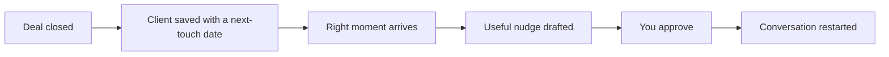

# Past-client nurture

## What it does

The people who bought or sold with you are your next listing — in 2 or 5 years. The AI tracks when their mortgage refixes, when a suburb spikes, when it's been a while — and sends a useful nudge at the right moment.

## The loop

## What a human still does

- Approves every touch
- Personalises anything about their situation

## What it runs on

A client list with next-touch dates the AI maintains.

---

*Want this for your business? Free 15-min build review: [yodalai.xyz](https://yodalai.xyz)*
