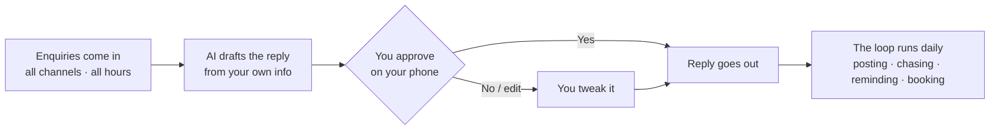

# The pattern — same every episode

Every business in this series runs on the same four steps. The workflows change; the pattern doesn't.

## Why the human gate is the point

The AI drafts, **you decide**. Anything sensitive — prices, promises, anything unusual — stops at your phone. That's what makes this trustworthy enough to run unattended overnight.

## What it runs on

A small always-on computer (a Mac mini is plenty) running an agent that watches your inbox, calendar and messages. **No website rebuild. No API needed.** The workflows meet the business where it already is.

## The 5-loop skeleton

Most businesses in this series use the same five loops, tuned to their world:

| Loop | What it does |
|---|---|
| 1 · Responder | Answers enquiries with the business's own information |
| 2 · Watcher / chaser | Follows up on quotes, documents, or anything gone quiet |
| 3 · Scheduler | Books appointments without double-ups, reminds people |
| 4 · Reviewer | Asks for the review or the next step while it's fresh |
| 5 · Nurturer | Brings past customers back at the right moment |

Each niche page shows exactly how those five map onto that business.

## Reading a blueprint

Every blueprint has the same structure:

- **The workflow map** — a picture of the loop
- **The daily loops** — what happens every day
- **What a human still does** — the approvals that never get automated away
- **Honest scope** — plan vs running system, no invented numbers

*Still reading? Book a free 15-min build review: [yodalai.xyz](https://yodalai.xyz)*
